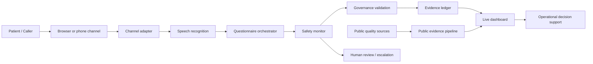

# CareGrid Voice Governance

Open-source reference demo for governed post-care voice feedback and public quality reporting.

This project demonstrates how a voice-based patient feedback experience can remain traceable, reviewable, and safety-aware without letting the model become the final authority on care quality or clinical risk.

## Why this project exists

CareGrid combines three signals:

- patient voice captured in a guided interview
- public provider quality data
- human review and policy boundaries

The system is designed to surface patient experience signals without turning a single complaint into a clinical finding or provider ranking.

## System overview



## Key principles

- The model is a conversation layer, not the system of record.
- Safety, consent, and questionnaire flow remain deterministic.
- Patient voice and public evidence are kept separate.
- Every evidence record includes source, time, provider match, and transformation history.
- Serious safety signals trigger escalation; they do not auto-create a finding.

## Project structure

```text
caregrid-voice-governance/
├── data/
│   ├── providers.json
│   └── public-measures.json
├── docs/
│   ├── ARCHITECTURE.md
│   ├── GOVERNANCE.md
│   └── THREAT_MODEL.md
├── public/
│   ├── index.html
│   ├── app.js
│   └── styles.css
├── src/
│   ├── core/
│   │   ├── questionnaire.js
│   │   ├── safety.js
│   │   ├── provenance.js
│   │   ├── providerMatching.js
│   │   ├── publicSources.js
│   │   └── reporting.js
│   ├── conversation/
│   │   ├── sessionState.js
│   │   └── conversationEngine.js
│   ├── adapters/
│   │   └── speech/
│   │       └── fakeSpeech.js
│   ├── server.js
│   └── store.js
├── tests/
│   ├── api.test.js
│   ├── safety.test.js
│   └── conversation.test.js
├── apps/
│   └── voice_backend/
│       ├── main.py
│       ├── config.py
│       ├── README.md
│       ├── requirements.txt
│       └── services/
├── package.json
├── LICENSE
├── README.md
├── CONTRIBUTING.md
├── SECURITY.md
├── CODE_OF_CONDUCT.md
└── .gitignore
```

## Quick start

### 1) Install and run the demo app

```bash
cd caregrid-voice-governance
npm install
npm run dev
```

Then open the local app in your browser.

### 2) Run the test suite

```bash
npm test
```

### 3) Run the backend cloud scaffold

```bash
cd caregrid-voice-governance
python3 -m venv .venv
source .venv/bin/activate
pip install -r apps/voice_backend/requirements.txt
uvicorn apps.voice_backend.main:app --host 0.0.0.0 --port 8010 --reload
```

## Demo behavior

The app includes:

- provider selection and consent gating
- specialty-aware question flow
- patient-feedback recording
- safety interruption for emergency or medical-advice boundary cases
- evidence creation and dashboard updates
- public-source context displayed separately from patient voice

## Safety boundaries

The application explicitly does not:

- diagnose or treat patients
- replace emergency services
- produce provider rankings from single patient reports
- merge patient-reported signals and public quality measures into a single opaque score

## Architecture and governance documentation

- Architecture: `docs/ARCHITECTURE.md`
- Governance model: `docs/GOVERNANCE.md`
- Threat model: `docs/THREAT_MODEL.md`

## Azure-aligned voice future path

The system is designed to map to Azure services for a production voice stack:

- Azure Communication Services for telephony and media
- Azure Speech for STT/TTS
- Azure OpenAI / Foundry for constrained response phrasing
- Redis and Cosmos DB for session state and evidence persistence
- Azure Container Apps for deployment
- Key Vault and telemetry services for secure operations

## Contribution

Please read the project contributing guide before submitting changes:

- `CONTRIBUTING.md`

## License

This project is licensed under the Apache 2.0 License.

## Repository navigation

If you are exploring the project, start here:

1. `public/index.html` — app entry point and UX flow
2. `src/server.js` — API and core runtime entry
3. `src/core/safety.js` — deterministic safety logic
4. `src/core/provenance.js` — evidence semantics and integrity
5. `docs/GOVERNANCE.md` — policy and review boundaries
6. `apps/voice_backend/README.md` — cloud backend path

## Project intent

This repo is meant to be a transparent reference implementation: a healthcare feedback system that is understandable, governable, and safe-by-design.

> “One report is a signal. Repeated, corroborated evidence becomes a trend.”
