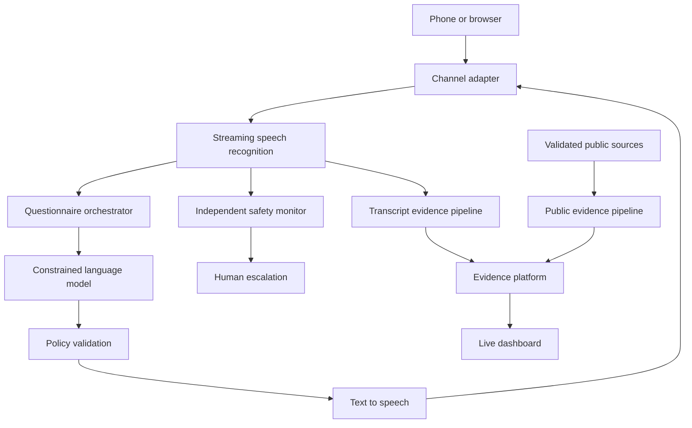

# Architecture

CareGrid is organized around two principles:

1. The conversation model is not the system of record or policy authority.
2. Patient-reported evidence and public-source evidence remain separate and traceable.

## Current demo components

- `src/core/questionnaire.js`: versioned universal and specialty-aware questions.
- `src/core/safety.js`: visible, deterministic emergency and boundary rules.
- `src/core/provenance.js`: evidence creation, transformations and integrity hashes.
- `src/core/providerMatching.js`: exact NPI and reviewable fuzzy matching.
- `src/core/publicSources.js`: allowlisted, provenance-preserving public ingestion.
- `src/core/reporting.js`: dashboard projection that keeps evidence classes separate.
- `src/server.js`: dependency-free API, static host and server-sent events.
- `public/`: accessible interactive demonstration.

## Production Azure adapters

The open interfaces are intended to map to:

| Interface | Azure implementation |
| --- | --- |
| Phone/SIP | Azure Communication Services |
| STT/TTS | Azure AI Speech |
| Optional natural voice | Azure Voice Live |
| Language reasoning | Azure OpenAI / AI Foundry |
| Event stream | Event Hubs |
| Operational records | Azure Database for PostgreSQL |
| Audio objects | Blob Storage with retention policy |
| Search | Azure AI Search |
| Analytics | Microsoft Fabric or Azure Data Explorer |
| Identity | Microsoft Entra ID |
| Secrets | Key Vault |

## Deliberate boundaries

- The browser speech API is used only for the local demonstration.
- The demo uses synthetic public measures and providers.
- No diagnosis, treatment or clinical decision support is implemented.
- A serious signal creates a review requirement; it does not create a finding.
- No public provider score is calculated from a single report.

## Review points

Search for `REVIEW-NOTE` in the repository. These comments flag code requiring multidisciplinary review before production use.
